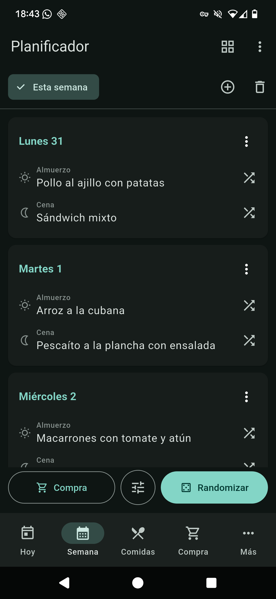
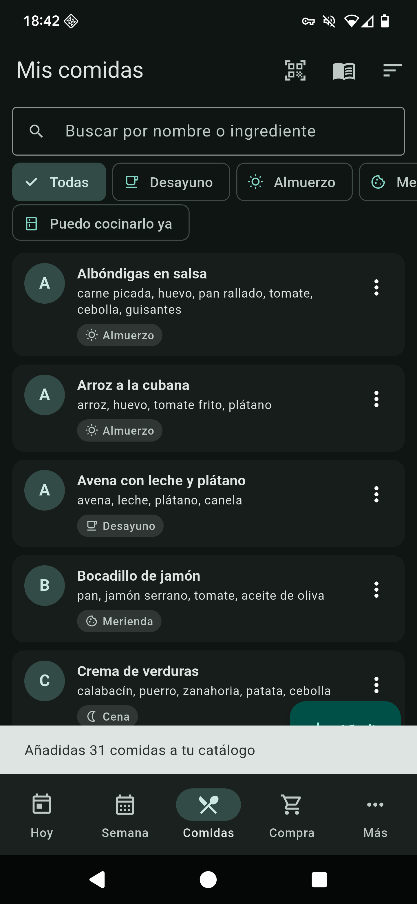
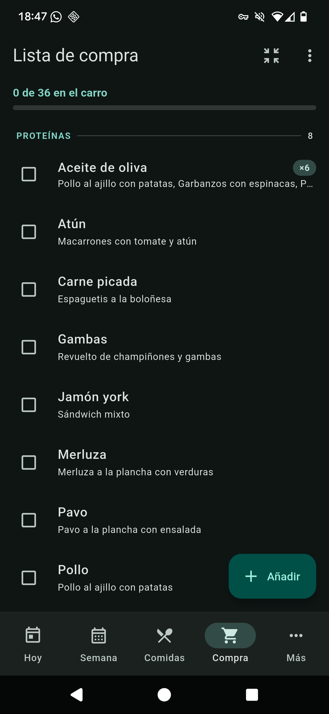
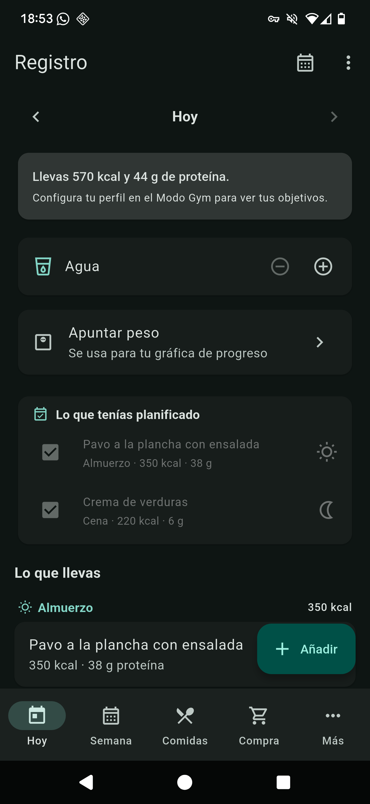

# Meal Planner

App de planificación de comidas semanales con seguimiento opcional de calorías y
proteína. Flutter · Android / iOS · todo local, sin cuenta ni servidor.

[](https://github.com/agevion/MealPlanner/actions/workflows/ci.yml)
[](LICENSE)
[](https://flutter.dev)

<p align="center">
  
  
  
  
</p>

## Qué hace

- **Planifica la semana**: 7 días × las tomas que quieras, con randomización que
  evita repetir platos e ingredientes y puede ajustarse a tus calorías.
- **Lista de la compra automática**: agrupada por pasillos del súper, con
  cantidades estimadas y modo "letra grande" para usarla comprando.
- **Registro diario**: apunta lo que comes por tomas, con anillo de calorías,
  barra de proteína, agua, peso y racha.
- **Despensa**: tus ingredientes con medidas caseras (1 filete, 1 loncha…),
  macros por unidad, stock y caducidad. De ahí sale "puedo cocinarlo ya".
- **Escáner de código de barras** (OpenFoodFacts) y **estimación con IA**
  (Gemini, con tu propia clave) para no pelearte con las macros.
- **Estadísticas**: medias, días cumplidos, evolución del peso, export a CSV.
- **Copia de seguridad completa** en un archivo JSON.

## Poner en marcha

Requiere Flutter 3.x. El escáner de código de barras y la estimación con IA son
opcionales: el segundo necesita una clave propia de Gemini, que se introduce
desde la app (Ajustes) y no va en el repositorio.

```bash
flutter pub get
```

```bash
flutter run
```

## Comprobar que todo sigue bien

```bash
flutter analyze
```

```bash
flutter test
```

## Cómo está hecho

Flutter con estado en `ChangeNotifier` y persistencia local en JSON sobre
`shared_preferences`: no hay backend, todo vive en el dispositivo y se puede
exportar a un archivo. Los textos están en `lib/l10n/` con un archivo por idioma
(español, inglés, francés, italiano y alemán). Las macros se calculan con
Mifflin-St Jeor y recomendaciones de proteína por kilo de peso, y el plan sugiere
ajustes según la evolución real del peso, sin cambiar nada por su cuenta.

## Documentación

- [DESIGN.md](DESIGN.md) — modelo de datos, arquitectura y lógica de negocio.
- [V2_IDEAS.md](V2_IDEAS.md) — catálogo de ideas y hoja de ruta.
- [CONTRIBUTING.md](CONTRIBUTING.md) — cómo trabajar en el proyecto.

## Notas

- La clave de la API de Gemini se guarda solo en el dispositivo y **no** se
  incluye en las copias de seguridad.
- El escáner necesita permiso de cámara (ya declarado en Android e iOS).

## English

Meal Planner is a weekly meal-planning app for Android and iOS, built with Flutter.
It fills a week with meals without repeating dishes or ingredients, turns that plan
into a shopping list grouped by supermarket aisle, and optionally tracks calories and
protein — with barcode scanning (OpenFoodFacts) and AI macro estimation (Gemini, using
your own key). Everything is stored on the device: no account, no server, and a full
JSON backup you own. The interface is translated into English, Spanish, French, Italian
and German; the project documentation is in Spanish.
